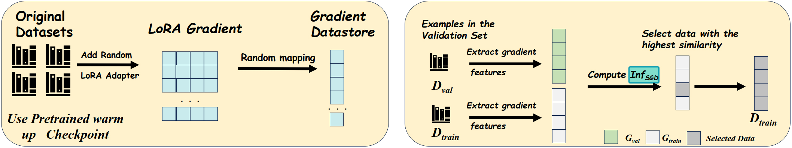
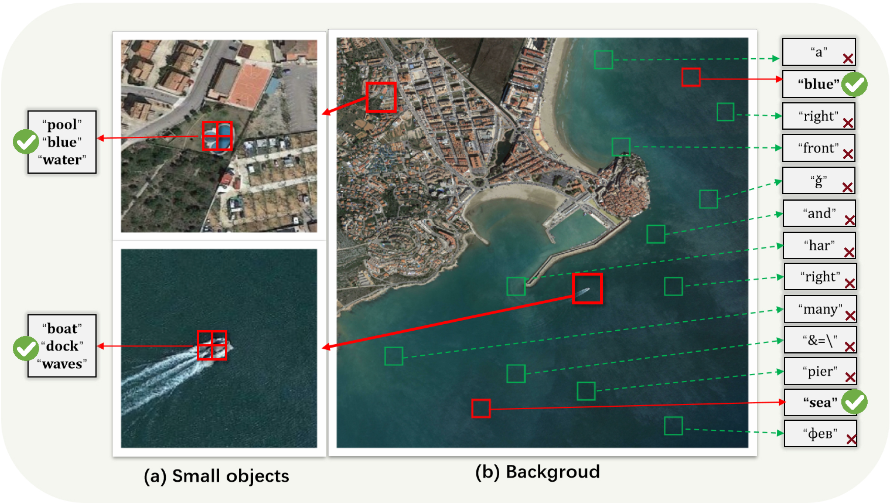
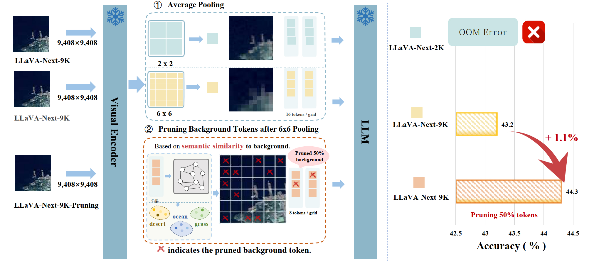
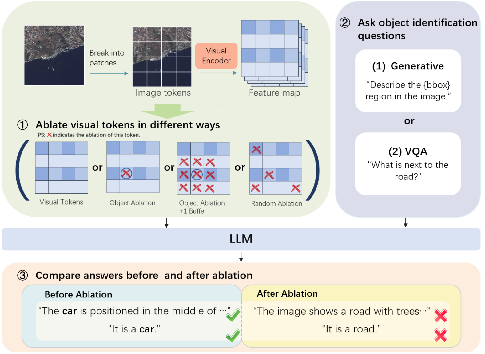
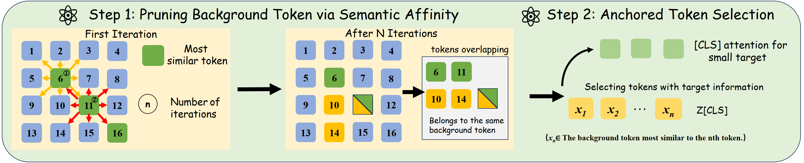

<div align="center">
  <h2><strong>GeoLLaVA-8K: Scaling Remote-Sensing Multimodal Large Language Models to 8K Resolution</strong></h2>
  <h5>
    <em>
      Fengxiang Wang<sup>1</sup>, Mingshuo Chen<sup>2</sup>, Yueying Li<sup>1</sup>, Di Wang<sup>4,5</sup>, Haotian Wang<sup>1</sup>, <br/>
      Zonghao Guo<sup>3</sup>, Zefan Wang<sup>3</sup>, Boqi Shan<sup>6</sup>, Long Lan<sup>1</sup>, Yuilin Wang<sup>3&nbsp;†</sup>, <br/>
      Hongzhen Wang<sup>3&nbsp;†</sup>, Wenjing Yang<sup>1&nbsp;†</sup>, Bo Du<sup>4</sup>, Jing Zhang<sup>4&nbsp;†</sup>
    </em>
    <br/><br/>
    <sup>1</sup> National University of Defense Technology, China<br/>
    <sup>2</sup> Beijing University of Posts and Telecommunications, China<br/>
    <sup>3</sup> Tsinghua University, China, <sup>4</sup> Wuhan University, China<br/>
    <sup>5</sup> Zhongguancun Academy, China, <sup>6</sup> Beihang University, China
  </h5>
  <p>
    📃 <a href="https://arxiv.org/abs/2505.21375" target="_blank">Paper</a> |
    🤗 <a href="https://huggingface.co/initiacms/GeoLLaVA-8K" target="_blank">Model</a> |
    🤗 <a href="https://huggingface.co/datasets/initiacms/GeoLLaVA-Data" target="_blank">Dataset</a>
  </p>
</div>


# 📚 Contents

- [📚 Contents](#-contents)
- [🔥News](#news)
- [📜Dataset](#dataset)
- [🔍Key Insights and Method](#key-insights-and-method)
  - [Key Insights](#key-insights)
  - [Method](#method)
- [🚀Finetuning and Evaluation](#finetuning-and-evaluation)
  - [Installation](#installation)
  - [Finetuning](#finetuning)
  - [Evaluation](#evaluation)
- [🔗Citation](#citation)
- [🤝Acknowledgement](#acknowledgement)

# 🔥News

* **[2025.09.19]**:Selected as **Spotlight** by NeurlPS 2025!
* **[2025.09.19]**: **GeoLLaVA-8k has been accepted by NeurlPS 2025.**
* **[Coming Soon]**  More details on motivation and ablation studies.
* **[2025.05.28]**  Training code together with model and dataset released.
* **[2025.05.27]**  The paper is available on [arXiv](https://arxiv.org/abs/2505.21375).


# 📜Dataset

We introduce two ultra-high-resolution (UHR) vision-language datasets for GeoLLaVA-8K:

- **SuperRS-VQA** (avg. 8,376×8,378) and **HighRS-VQA** (avg. 2,000×1,912), the highest-resolution RS VQA datasets to date.

- A total of **81,367** UHR image–text pairs (SuperRS-VQA + HighRS-VQA) are used for supervised fine-tuning of GeoLLaVA-8K.

- **Construction pipeline**:  
  1. **Manual annotation** of 12K UHR samples by experts and crowd-workers.  
  2. **Semi-automated generation** of 100K medium-to-high-resolution (2K×2K) pairs using GPT-4o, followed by an influence-based selection via the LESS framework.  
  3. **Deduplication** against existing RS datasets to minimize overlap.  
  
- **Data Selection Pipeline for MHR Data**

  To improve the relevance of our medium-to-high-resolution (MHR, 2K×2K) samples to UHR downstream tasks and **ensure its cultivation of reasoning capabilities** for models fine-tuned on it, we adopt an influence-based data selection pipeline.
  
  
  

# 🔍Key Insights and Method

## Key Insights

**Low Semantic Density in Remote-sensing Imagery**

1. **Overwhelming Background Tokens Hinder MLLM Fine-Tuning on RS Data**

   **Q1:** “Do background tokens dominate UHR RS imagery?”  
   Results show background coverage in RS images reaches up to **73.14%**.

   

   **Q2:** “What happens when you prune background tokens?”  
   Our pilot studies reveal significant redundancy in RS images: crucial information is concentrated in a small subset of object-centric tokens, while pruning background tokens (e.g., ocean or forest) **can even improve performance**.
   
   

2. **Scarce Object Tokens Drive MLLM Fine-Tuning on RS Data**

   **Q3:** “Whether essential information is concentrated in small targets and captured by corresponding visual tokens?”  
   Ablating object tokens (26.5) causes a **34.9%** drop in generative VQA and **24.8%** drop in discriminative VQA, whereas randomly removing the same number of tokens yields only **6.7%** and **1.1%** decreases—demonstrating that essential information is indeed localized in small target-aligned tokens.
   
   

## Method

**Background Token Pruning and Anchored Token Selection**




# 🚀Finetuning and Evaluation

GeoLLaVA is built upon [LongVA](https://github.com/EvolvingLMMs-Lab/LongVA), and tested on  A800-SXM4-80GB with CUDA12.1 and PyTorch 2.1.2.

## Installation

We recommend use [uv](https://github.com/astral-sh/uv) for environment setup.

```bash
uv venv -p 3.11 # or 3.10
uv pip install torch==2.1.2+cu121 torchvision==0.16.2+cu121 torchaudio==2.1.2+cu121 --index-url https://download.pytorch.org/whl/cu121
uv pip install flash-attn==2.7.3 --no-build-isolation --no-cache-dir # or install wheel mannualy
uv pip install -r requirements.txt --no-deps
cd longva && uv pip install -e . --no-deps
```

## Finetuning

Please first download the dataset from [huggingface](https://huggingface.co/collections/initiacms/geollava-8k-6836a1a482b1c892c5c8dad5). Then

```bash
cd longva
bash scripts/ft3.sh
```

## Evaluation

For evaluation, please use [lmms-eval](https://github.com/EvolvingLMMs-Lab/lmms-eval?tab=readme-ov-file) and refer the [XLRS-Bench-lite](https://github.com/AI9Stars/XLRS-Bench):

```bash
CKPT_PATH=initiacms/GeoLLaVA-8K # or local path
accelerate launch --num_processes 8 --main_process_port 12345 -m lmms_eval \
    --model "longva" \
    --model_args "pretrained=${CKPT_PATH},use_flash_attention_2=True"  \
    --tasks xlrs-lite \
    --batch_size 1 \
    --log_samples \
    --log_samples_suffix longva_xlrs_lite \
    --output_path ./logs/
```

# 🔗Citation

If you find our work helpful, please consider citing:

```latex
@article{wang2025geollava8kscalingremotesensingmultimodal,
      title={GeoLLaVA-8K: Scaling Remote-Sensing Multimodal Large Language Models to 8K Resolution}, 
      author={Fengxiang Wang and Mingshuo Chen and Yueying Li and Di Wang and Haotian Wang and Zonghao Guo and Zefan Wang and Boqi Shan and Long Lan and Yulin Wang and Hongzhen Wang and Wenjing Yang and Bo Du and Jing Zhang},
  journal={arXiv preprint arXiv:2505.21375},
      year={2025},
}
```

# 🤝Acknowledgement

* [LongVA](https://github.com/EvolvingLMMs-Lab/LongVA): Long Context Transfer from Language to Vision, extends llava-next to 2k resolution.
* [lmms-eval](https://github.com/EvolvingLMMs-Lab/lmms-eval?tab=readme-ov-file): The Evaluation Suite of Large Multimodal Models.
